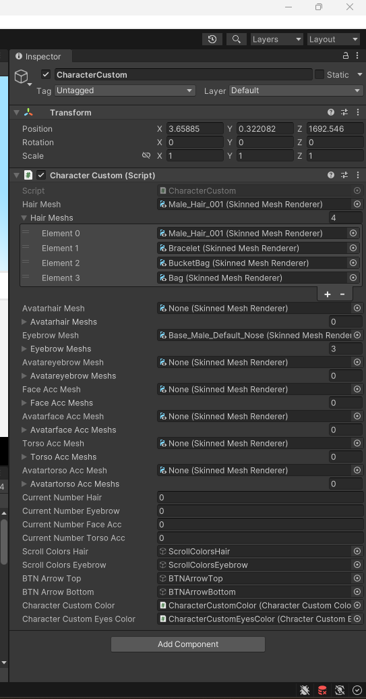
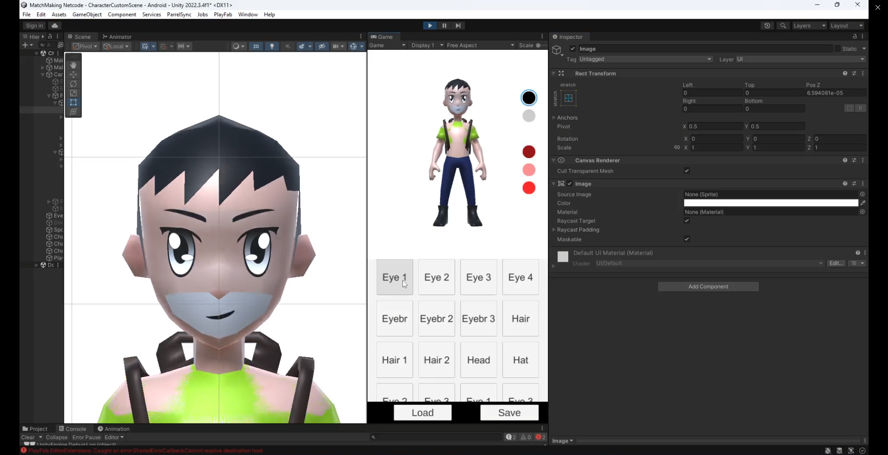
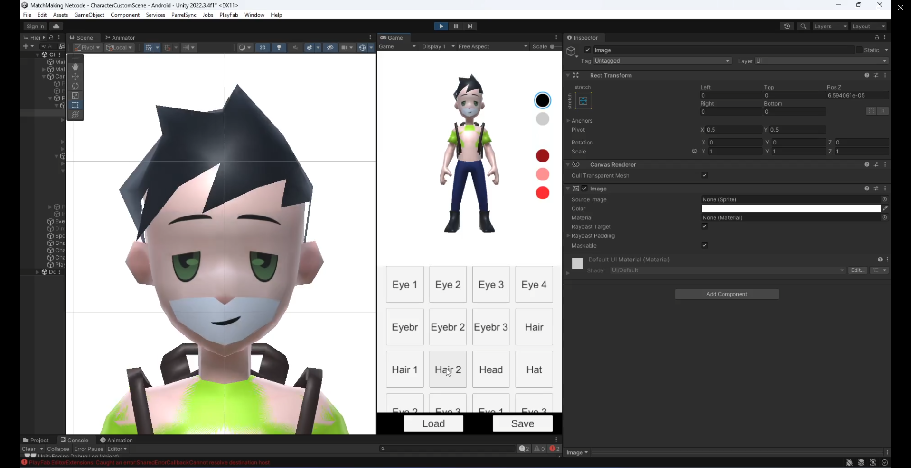
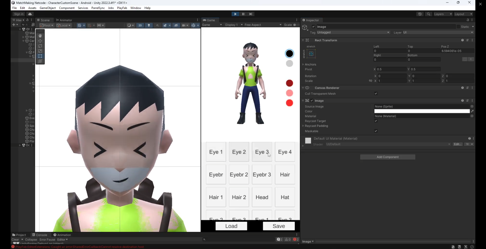

# Unity Character Customization System

Engine Version: Unity 2022.3.21f1  
Language: C#

## Overview

A modular character customization prototype allowing runtime accessory switching using SkinnedMeshRenderer.

## Key Features

- Equip / Unequip accessories  
- Runtime mesh replacement  
- Modular character setup  
- Basic UI interaction  

## Preview

### Inspector (SkinnedMeshRenderer)

### Character Customization Switching

---

## Gameplay Video

https://youtu.be/M6nvoqqx7no

## Technical Focus

- SkinnedMeshRenderer manipulation  
- Runtime mesh swapping  
- Component-based architecture
