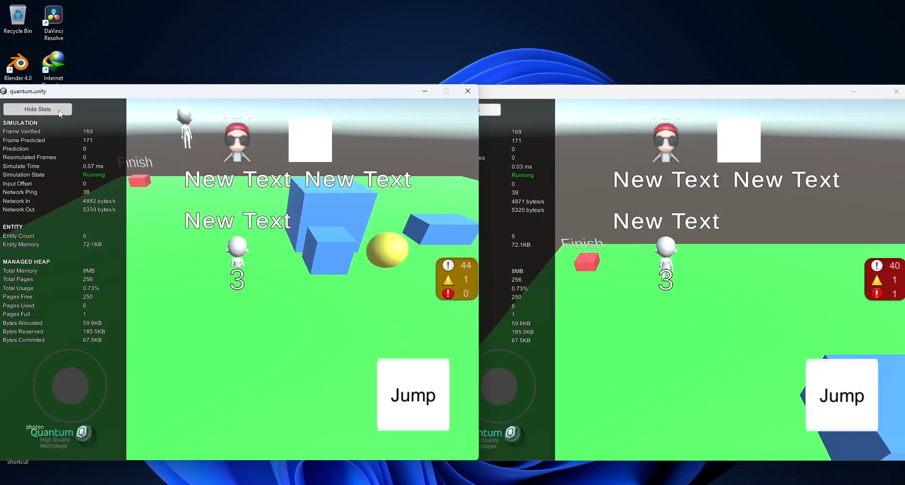
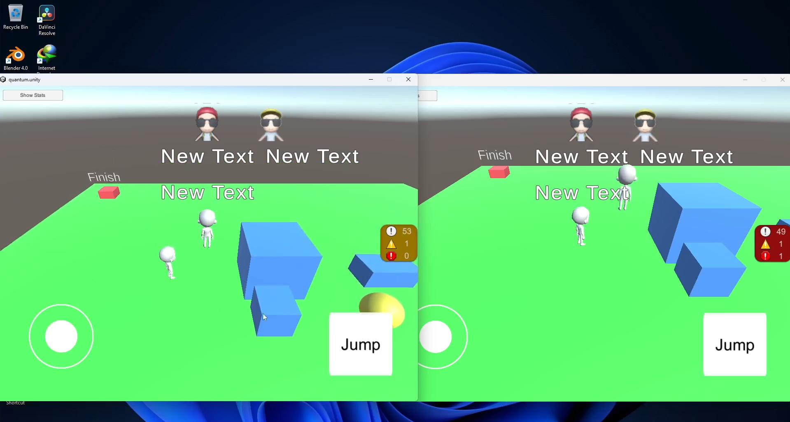
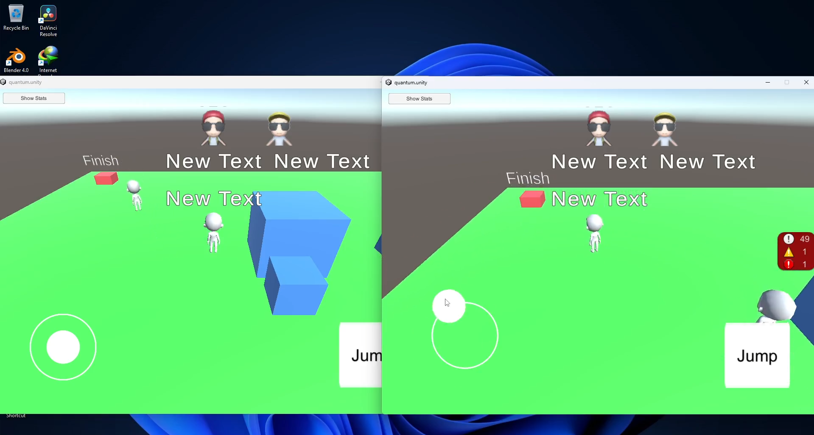

# Unity Photon Quantum Multiplayer Prototype

Engine Version: Unity 2022.3.21f1 + Photon Quantum 2.1.7  
Language: C#

## Overview

This prototype demonstrates deterministic multiplayer gameplay using Photon Quantum ECS-based simulation.
Core gameplay logic runs inside the Quantum deterministic simulation layer, while Unity acts as the visual presentation layer.
The project includes matchmaking, account synchronization, and mobile input handling.

---

## Key Features

- Quick Play matchmaking system  
- PlayFab account integration (username & avatar sync)  
- Deterministic ECS-based movement simulation  
- Network-synchronized jump input  
- Mobile touch joystick movement  
- Separation between simulation logic and Unity rendering layer  
- Dual client synchronization testing

---

## Architecture Concept

- Quantum Simulation Layer → deterministic gameplay logic  
- Unity View Layer → visual representation & UI  
- Input captured in Unity → processed inside Quantum simulation  
- State updates synchronized across clients

---

## Preview

### Matchmaking & Lobby

### In-Game Deterministic Movement

---

## Gameplay Video

https://youtu.be/u1lvMYBT41E

---

## Technical Focus

- Deterministic multiplayer architecture  
- ECS-based simulation  
- Input synchronization  
- Client state consistency  
- Data-driven UI updates
